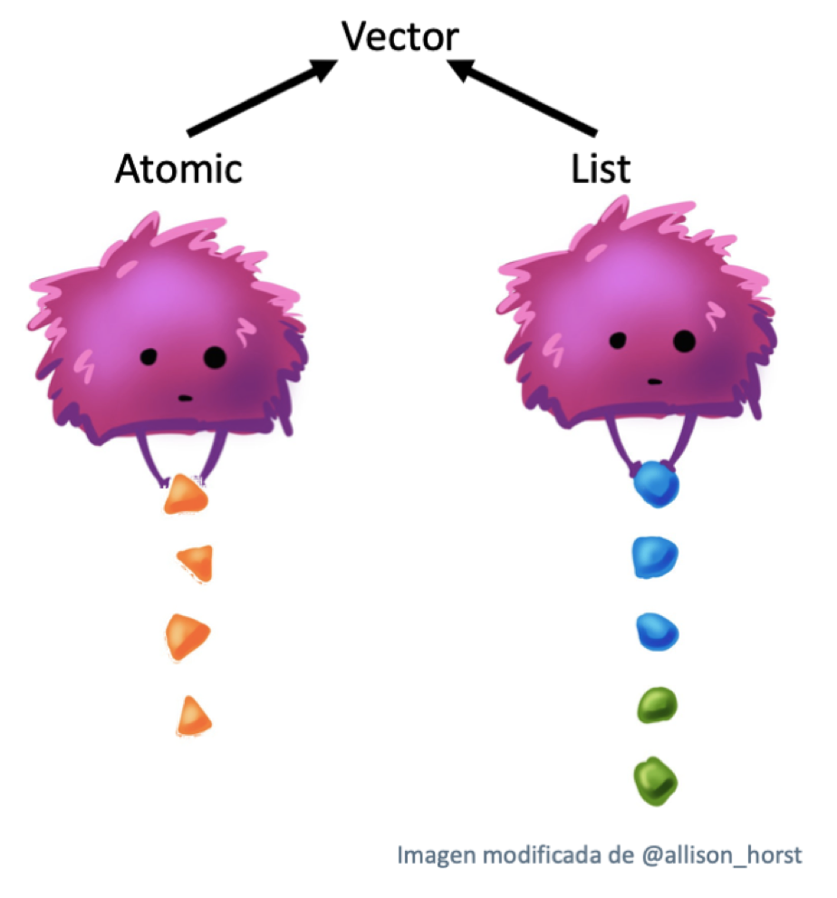
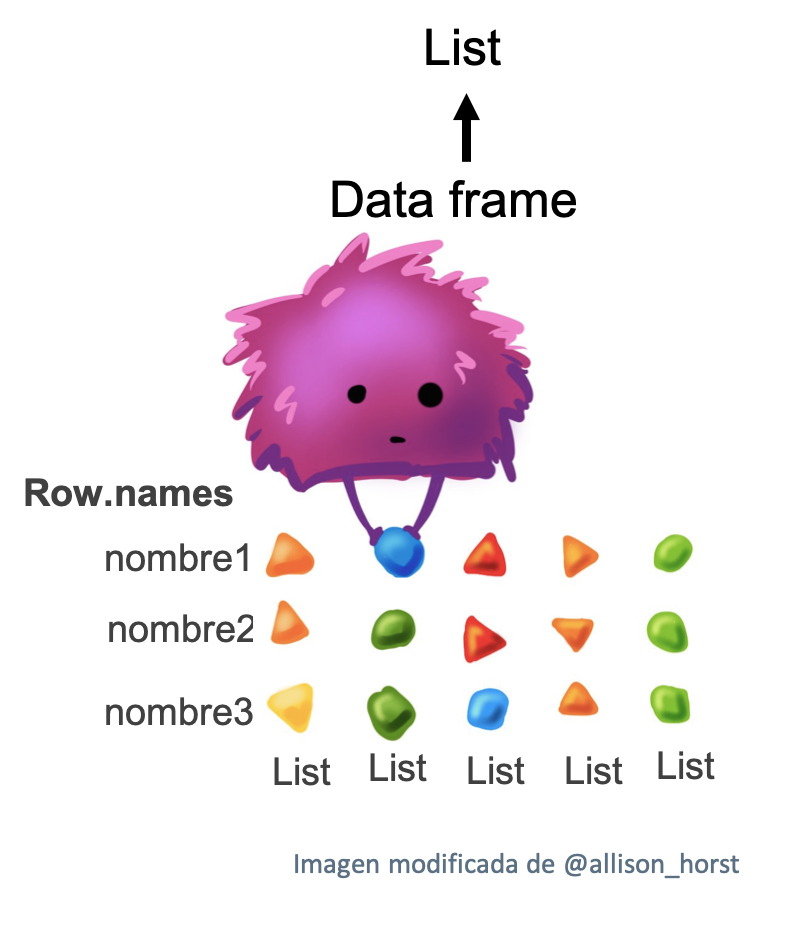

# Vectores {#vectors-chap}

```{r setup, include = FALSE}
source("common.R")
```


## Introdución
\index{vectors}
\index{nodes}

Este capítulo trata de la familia más importante de tipos de datos en R básico: los vectores[^node]. Aunque probablemente ya hayas utilizado muchos (si no todos) de los diferentes tipos de vectores, puede que no hayas pensado profundamente en cómo están interrelacionados. En este capítulo, no cubriré los tipos de vectores individuales con demasiado detalle, pero te mostraré cómo todos los tipos encajan en su conjunto. Si necesitas más detalles, puedes encontrarlos en la documentación de R.

[^node]: Colectivamente, todos los demás tipos de datos se conocen como tipos "nodo", que incluyen cosas como funciones y entornos. Lo más probable es que te encuentres con este término tan técnico cuando utilices `gc()`: la "N" de `Ncells` significa nodos y la "V" de `Vcells` significa vectores.

Hay dos tipos de vectores: vectores atómicos y listas [^generic-vectors]. Se diferencian por los tipos de sus elementos: en los vectores atómicos, todos los elementos deben tener el mismo tipo; en las listas, los elementos pueden tener diferentes tipos. Aunque no es un vector, `NULL` está estrechamente relacionado con los vectores y a menudo cumple el papel de vector genérico de longitud cero. Este diagrama, que ampliaremos a lo largo de este capítulo, ilustra las relaciones básicas:


```{r, echo = FALSE, out.width = NULL}
knitr::include_graphics("diagrams/vectors/summary-tree.png")
```

Mi interpretación de este diagrama está ilustrado usando una imagen de [Allison Horst](https://twitter.com/allison_horst) modificada. 


```{r, echo = FALSE, out.width = NULL}

```


[^generic-vectors]: En algunos lugares de la documentación de R se llama a las listas *vectores genéricos* para enfatizar su diferencia con los vectores atómicos.

Cada vector también puede tener __atributos__, que se pueden considerar como una lista nombrada de metadatos arbitrarios. Hay dos atributos especialmente importantes. El atributo __dimensión__ convierte los vectores en matrices y arrays y el atributo __clase__ potencia el sistema de objetos S3. Aunque aprenderás a usar S3 en el capítulo \@ref(s3), aquí aprenderás sobre algunos de los vectores más importantes de S3: factores, fechas y horas, data frames y tibbles. Y aunque las estructuras 2D como las matrices y las data frames no son necesariamente lo que te viene a la mente cuando piensas en vectores, también aprenderás por qué R los considera vectores.


### Quiz {-}

Realice este breve cuestionario para determinar si necesita leer este capítulo. Si las respuestas le vienen rápidamente a la cabeza, puede saltarse cómodamente este capítulo. Puedes comprobar tus respuestas en la sección \ref(data-structure-answers).

1. ¿Cuáles son los cuatro tipos comunes de vectores atómicos? ¿Cuáles son los dos 
   tipos raros?

1. ¿Qué son los atributos? ¿Cómo se obtienen y se fijan?

1. ¿En qué se diferencia una lista de un vector atómico? ¿En qué se diferencia una matriz
   de un data frame?

1. ¿Se puede tener una lista que sea una matriz? 2. ¿Puede un data frame tener una columna 
   que sea una matriz?
   
1. ¿En qué se diferencian los tibbles de los data frames?


### Outline {-}

* La sección \@ref(atomic-vectors) introduce los vectores atómicos:
  lógico, entero, doble y carácter. Estas son las estructuras de datos más simples de R.
  
* La sección \@ref(attributes) da un pequeño desvío para hablar de los atributos, la especificación flexible de metadatos de R. Los atributos más importantes son nombres, dimensiones y clase.
  
* La sección \@ref(s3-atomic-vectors) discute los tipos de vectores importantes que se construyen combinando vectores atómicos con atributos especiales. Estos incluyen factores, fechas, fechas-horas y duraciones.
  
* La sección \@ref(lists) se sumerge en las listas. Las listas son muy similares a los vectores atómicos, pero tienen una diferencia clave: un elemento de una lista puede ser cualquier tipo de dato, incluyendo otra lista. Esto las hace adecuadas para representar datos jerárquicos.

* La sección \@ref(tibble) nos enseña sobre las data frame y los tibbles, que
  se utilizan para representar datos rectangulares. Combinan el comportamiento  de las listas y las matrices para crear una estructura ideal para las necesidades de datos estadísticos.


## Vectores atomic {#atomic-vectors}
\index{atomic vectors} 
\index{vectors!atomic|see {atomic vectors}}
\index{logical vectors} 
\index{integer vectors} 
\index{double vectors} 
\index{numeric vectors} 
\index{character vectors} 

Existen cuatro tipos principales de vectores atómicos: lógicos, enteros, dobles y de caracteres (que contienen cadenas o *strings*). Los vectores enteros y dobles en conjunto se conocen como vectores numéricos[^numeric]. Hay dos tipos poco comunes: complejos y crudos. No hablaré de ellos porque los números complejos rara vez se necesitan en estadística, y los vectores crudos son un tipo especial que sólo se necesita cuando se manejan datos binarios.  

```{r, echo = FALSE, out.width = NULL}
knitr::include_graphics("diagrams/vectors/summary-tree-atomic.png")
```

[^numeric]: Se trata de una ligera simplificación, ya que R no utiliza "numérico" de forma consistente, algo que retomaremos en la sección \@ref(numeric-type).

### Escalares
\index{scalars}
\indexc{NaN}
\indexc{Inf} 
\indexc{L}
\indexc{""}
\indexc{'}

Cada uno de los cuatro tipos primarios tiene una sintaxis especial para crear un valor individual, AKA a __escalar__[^scalar]:

* **Logicals**: Los lógicos pueden escribirse completos (`TRUE` o `FALSE`), o abreviados 
  (`T` o `F`).

* **Dobles**: Los dobles pueden especificarse en forma decimal (`0.1234`), científica (`1.23e4`) o  hexadecimal (`0xcafe`). Hay tres valores especiales exclusivos de dobles: `Inf`, `-Inf` y `NaN` (no son números). Son valores especiales  definidos por el estándar de punto flotante. 

* **Integers**: Los enteros se escriben de forma similar a los dobles, pero deben ir seguidos de  `L`[^L-suffix] (`1234L`, `1e4L`, o `0xcafeL`), y no pueden contener valores fraccionarios. 

* **Strings**: Las cadenas de texto están rodeadas por `"` (`"hola"`) o `'` (`'adiós'`). Los caracteres especiales se ponen con `\`; para más detalles, véase `?Quotes`.

[^L-suffix]: `L` no es intuitivo, y puede que te preguntes de dónde viene. En el momento en que se añadió `L` a R, el tipo entero de R era equivalente a un entero largo en C, y el código C podía utilizar un sufijo de `l` o `L` para forzar que un número fuera un entero largo. Se decidió que `l` era demasiado similar visualmente a `i` (usado para números complejos en R), dejando `L`.

[^scalar]: Técnicamente, el lenguaje R no posee escalares. Todo lo que parece un escalar es en realidad un vector de longitud uno. Esto es más que nada una distinción teórica, pero significa que expresiones como `1[1]` funcionan.

### Haciendo vectores más grandes con `c()` {#atomic-constructing}
\indexc{typeof()}
\indexc{length()}
\indexc{c()} 

Para crear vectores más largos a partir de otros más cortos, utiliza `c()`, abreviatura de combinar (*combine*):

```{r}
lgl_var <- c(TRUE, FALSE)
int_var <- c(1L, 6L, 10L)
dbl_var <- c(1, 2.5, 4.5)
chr_var <- c("these are", "some strings")
```

Cuando las entradas son vectores atómicos, `c()` siempre crea otro vector atómico; es decir, aplana:

```{r}
c(c(1, 2), c(3, 4))
```

En los diagramas, representaré los vectores como rectángulos conectados, por lo que el código anterior podría dibujarse así:

```{r, echo = FALSE, out.width = NULL}
knitr::include_graphics("diagrams/vectors/atomic.png")
```

Puedes determinar el tipo de un vector con `typeof()`[^mode] y su longitud con`length()`.

```{r}
typeof(lgl_var)
typeof(int_var)
typeof(dbl_var)
typeof(chr_var)
```

[^mode]: Puede que hayas oído hablar de las funciones relacionadas `mode()` y `storage.mode()`. No las utilice: existen sólo por compatibilidad con S.

### Valores ausentes
\indexc{NA}
\indexc{is.na}
\index{missing values|see {\texttt{NA}}}

R representa los valores ausentes, o desconocidos, con un valor especial centinela: `NA` (abreviatura de *no aplicable*). Los valores ausentes tienden a ser infecciosos: la mayoría de los cálculos que implican un valor ausente devolverán otro valor.

```{r}
NA > 5
10 * NA
!NA
```

Sólo hay unas pocas excepciones a esta regla. Estas ocurren cuando alguna identidad se mantiene para todas las entradas posibles:

```{r}
NA ^ 0
NA | TRUE
NA & FALSE
```

La propagación de la falta de valores conduce a un error común al determinar qué valores de un vector faltan:

```{r}
x <- c(NA, 5, NA, 10)
x == NA
# x <- c(0, 5, 1, 10) # chear con un vector sin NAs
```

Este resultado es correcto (aunque un poco sorprendente) porque no hay ninguna razón para creer que un valor perdido tenga el mismo valor que otro. En su lugar, utilice `is.na()` para comprobar la presencia de valores ausentes:

```{r}
is.na(x)
```

NB: Técnicamente hay cuatro valores que faltan, uno para cada uno de los tipos atómicos: `NA` (lógico), `NA_integer_` (entero), `NA_real_` (doble), y `NA_character_` (carácter). Esta distinción no suele ser importante porque `NA` se coacciona automáticamente al tipo correcto cuando se necesita.

### Pruebas y coerción
\index{coercion}
\indexc{is.vector()}
\indexc{is.atomic()}
\indexc{is.numeric()}

Generalmente, se puede __probar__ si un vector es de un tipo determinado con una función `is.*()`, pero estas funciones deben usarse con cuidado. Las funciones `is.logical()`, `is.integer()`, `is.double()` y `is.character()` hacen lo que se espera: comprueban si un vector es un carácter, un doble, un entero o un lógico. Evita `is.vector()`, `is.atomic()` y `is.numeric()`: no comprueban si tiene un vector, un vector atómico o un vector numérico; tendrás que leer cuidadosamente la documentación para averiguar lo que realmente hacen.

Para los vectores atómicos, el "tipo" es una propiedad de todo el vector: todos los elementos deben ser del mismo tipo. Cuando intentes combinar diferentes tipos serán __forzados__ en un orden fijo: carácter → doble → entero → lógico. Por ejemplo, al combinar un carácter y un entero se obtiene un carácter:

```{r}
str(c("a", 1))

# Checar:
str(c(TRUE,FALSE))
str(c(TRUE,2))
str(c(TRUE,2.4))
str(c(TRUE,"a"))
```

La coerción suele ser automática. La mayoría de las funciones matemáticas (`+`, `log`, `abs`, etc.) forzan a numérico. Esta coerción es particularmente útil para los vectores lógicos porque `TRUE` se convierte en 1 y `FALSE` en 0.

```{r}
x <- c(FALSE, FALSE, TRUE)
as.numeric(x)

# Total number of TRUEs
sum(x)

# Proportion that are TRUE
mean(x)
```

Generalmente, se puede forzar deliberadamente utilizando una función `as.*()`, como `as.logical()`, `as.integer()`, `as.double()`, o `as.character()`. La coerción fallida de cadenas genera una advertencia y un valor ausente:

```{r}
as.integer(c("1", "1.5", "a"))
```

### Ejercicios

1. ¿Cómo se crean escalares crudos y complejos? (Ver `?raw` y `?complex`.). 

Utilizando las funciones `as.raw()` y `complex()`.

2. Comprueba tu conocimiento de las reglas de coerción de vectores prediciendo la salida de los siguientes usos de `c()`:

El resultado se puede checar con `typeof()`

```{r, eval=FALSE}
c(1, FALSE) # double
c("a", 1) # character
c(TRUE, 1L) # integer
```

3. ¿Por qué es verdadero `1 == "1"`? 2. ¿Por qué es verdadero `-1 < FALSE`? ¿Por qué es falso `"one" < 2`?

Porque el orden en que se forzan los datos es: lógico → entero →  doble → carácter, así que :

- `1 == "1"` se convierte en `"1" == "1"` (Checar con `c(-1, FALSE)`) lo cual es verdadero.

- `-1 < FALSE` se convierte en `-1 < 0` (Checar con `c(-1, FALSE)`) lo cual es verdadero.

- `"one" < 2` se convierte en `"one" < "2"` (Checar con `c("one", 2)`) lo cual es falso.


4. ¿Por qué el valor ausente por defecto, `NA`, es un vector lógico? ¿Qué tiene de especial de los vectores lógicos? (Pista: piensa en `c(FALSE, NA_character_)`.)

Por el orden en que son forzados los valores, Hadley nos describe la jerarquía carácter → doble → entero → lógico, así que los valores serán forzados en el orden inverso: lógico → entero →  doble → carácter. Si `NA` fuera un carácter `"NA"`, todos los valores se convertirían en caracter `c(FALSE, NA_character_)` pero si es del típo lógico los valores no serán forzados a otro tipo, checa lo que pasa con:

```{r}
str(c(FALSE, NA))
str(c(FALSE, NA_integer_))
str(c(FALSE, NA_real_))
str(c(FALSE, NA_character_))
```


5. Precisamente, ¿qué comprueban `is.atomic()`, `is.numeric()` y `is.vector()`?

- `?is.atomic`: "is.atomic devuelve TRUE si x es de tipo atómico (o NULL) y FALSE en caso contrario."

- `?is.numeric`:  "is.numeric es una prueba más general de que un objeto es interpretable como números. Devuelve TRUE si su argumento es de modo "numérico" (tipo "doble" o tipo "entero") y no es un factor, y FALSE en caso contrario. Es decir, is.integer(x) || is.double(x), o (mode(x) == "numeric") && !is.factor(x)."

- `is.vector`: "is.vector devuelve TRUE si x es un vector del modo especificado que no tiene más atributos que los nombres. En caso contrario, devuelve FALSE."


## Atributos {#attributes}
\index{attributes}

Puede que te hayas dado cuenta de que el conjunto de vectores atómicos no incluye una serie de estructuras de datos importantes como las matrices, los arrays, los factores o las fechas-hora. Estos tipos se construyen sobre los vectores atómicos añadiendo atributos. En esta sección, aprenderás los fundamentos de los atributos, y cómo el atributo dim crea matrices y arrays. En la siguiente sección aprenderás cómo se utiliza el atributo class para crear vectores S3, incluyendo factores, fechas y fechas-hora.

### Obtención y configuración (Getting and setting)
\indexc{attr()}
\index{attributes!attributes@\texttt{attributes()}}
\indexc{structure()}

Puedes pensar en los atributos como parejas de nombre-valor[^pairlist] que ligan los metadatos a un objeto. Los atributos individuales pueden ser extraídos y modificados con `attr()`, o extraídos en masa con `attributes()`, y definidos en masa con `structure()`.

[^pairlist]: Los atributos se comportan como listas con nombre, pero en realidad son listas emparejadas.  Las listas emparejadas son funcionalmente indistinguibles de las listas, pero son profundamente diferentes bajo el capó. Aprenderás más sobre ellas en la sección \@ref(pairlists). 

```{r}
a <- 1:3
attr(a, "x") <- "abcdef"
attr(a, "x")

attr(a, "y") <- 4:6
str(attributes(a))

# Or equivalently
a <- structure(
  1:3, 
  x = "abcdef",
  y = 4:6
)
str(attributes(a))
```

```{r, echo = FALSE, out.width = NULL}
knitr::include_graphics("diagrams/vectors/attr.png")
```

En general, los atributos deben considerarse efímeros. Por ejemplo, la mayoría de los atributos se pierden con la mayoría de las operaciones:

```{r}
attributes(a[1])
attributes(sum(a))
```

Sólo hay dos atributos que se conservan de forma rutinaria: 

* __names__, un vector de caracteres que da un nombre a cada elemento.
* __dim__, abreviatura de dimensions, un vector de enteros, utilizado para convertir vectores en matrices o arrays.

Para preservar otros atributos, tendrás que crear tu propia clase S3, el tema del capítulo \@ref(s3).

### Nombres {#attr-names}
\index{attributes!names}
\indexc{names()}
\indexc{setNames()}
 
Se puede nombrar un vector de tres maneras:

```{r}
#  Al crearlo:  
x <- c(a = 1, b = 2, c = 3)

# Al asignar un vector de caracteres a names()
x <- 1:3
names(x) <- c("a", "b", "c")

# En línea, con setNames():
x <- setNames(1:3, c("a", "b", "c"))
```

Evita usar `attr(x, "nombres")` ya que requiere más escritura y es menos legible que `names(x)`. Puedes eliminar los nombres de un vector utilizando `x <- unname(x)` o `names(x) <- NULL`. 

Para ser técnicamente correcto, al representar el vector con nombre `x`, debería dibujarlo así:

```{r, echo = FALSE, out.width = NULL}
knitr::include_graphics("diagrams/vectors/attr-names-1.png")
```

Sin embargo, los nombres son tan especiales y tan importantes, que a menos que esté tratando específicamente de llamar la atención sobre la estructura de datos de los atributos, los utilizaré para etiquetar el vector directamente:

```{r, echo = FALSE, out.width = NULL}
knitr::include_graphics("diagrams/vectors/attr-names-2.png")
```

Para que sean útiles con el subconjunto de caracteres (p. ej. Sección \@ref(lookup-tables)) los nombres deben ser únicos y no faltar, pero esto no lo impone R. Dependiendo de cómo se establezcan los nombres, los nombres que faltan pueden ser `""` o `NA_character_`. Si faltan todos los nombres, `names()` devolverá `NULL`.

### Dimensiones {#attr-dims}
\index{arrays} 
\index{matrices|see {arrays}}
\index{attributes!dimensions}

Añadir un atributo `dim` a un vector le permite comportarse como una __matriz__ bidimensional o una __array__ multidimensional. Las matrices y los arrays son principalmente herramientas matemáticas y estadísticas, no de programación, por lo que se utilizarán con poca frecuencia y sólo se tratarán brevemente en este libro. Su característica más importante es el subconjunto multidimensional, que se cubre en la Sección \@ref(subconjunto-matriz).

Puede crear matrices y arrays con `matrix()` y `array()`, o utilizando la forma de asignación de `dim()`:

```{r}
# Dos argumentos escalares especifican el tamaño de las filas y las columnas
x <- matrix(1:6, nrow = 2, ncol = 3)
x

# Un argumento vectorial para describir todas las dimensiones
y <- array(1:12, c(2, 3, 2))
y

# También puedes modificar un objeto en su lugar estableciendo dim()
z <- 1:6
dim(z) <- c(3, 2)
z
```

Muchas de las funciones para trabajar con vectores tienen generalizaciones para las matrices y los arrays:

| Vector            | Matrix                     | Array            |
|-------------------|----------------------------|------------------|
| `names()`         | `rownames()`, `colnames()` | `dimnames()`     |
| `length()`        | `nrow()`, `ncol()`         | `dim()`          |
| `c()`             | `rbind()`, `cbind()`       | `abind::abind()` |
| ---               | `t()`                      | `aperm()`        |
| `is.null(dim(x))` | `is.matrix()`              | `is.array()`     |

Un vector sin el atributo `dim` suele considerarse de una dimensión, pero en realidad tiene dimensiones `NULL`. También puedes tener matrices con una sola fila o una sola columna, o matrices con una sola dimensión. Pueden imprimirse de forma similar, pero se comportarán de forma diferente. Las diferencias no son demasiado importantes, pero es útil saber que existen en caso de que obtenga una salida extraña de una función (`tapply()` es un infractor frecuente). Como siempre, use `str()` para revelar las diferencias.

```{r}
str(1:3)                   # 1d vector
str(matrix(1:3, ncol = 1)) # column vector
str(matrix(1:3, nrow = 1)) # row vector
str(array(1:3, 3))         # "array" vector
```

### Ejercicios

1.  ¿Cómo se implementa `setNames()`? 2. ¿Cómo se implementa `unname()`?
    Lee el código fuente.
    
```{r}
setNames

unname
```


2.  ¿Qué devuelve `dim()` cuando se aplica a un vector unidimensional? ¿Cuándo podrías utilizar `NROW()` o `NCOL()`?

```{r}
x <- 1:5
dim(x)
NROW(x)
NCOL(x)
```


3.  ¿Cómo describirías los tres objetos siguientes? ¿En qué se diferencian de `1:5`?

```{r}

# dim() da como resultdo # filas, # columnas, #...
x1 <- array(1:5, c(1, 1, 5))
dim(x1)

x2 <- array(1:5, c(1, 5, 1))
dim(x2)

x3 <- array(1:5, c(5, 1, 1))
dim(x3)

# 1:5 es diferente en las dimensiones
dim(x)
```

5. En un primer borrador utilizaba este código para ilustrar `structure()`:

Pero cuando se imprime ese objeto no se ve el atributo de comentario.  ¿Por qué? ¿Falta el atributo, o hay algo especial en él? (Sugerencia: intenta usar la ayuda).

```{r}
y <- structure(1:5, comment = "my attribute")
y 

attr(y, which = "comment")
attributes(y)
```


## S3 Vectores atómicos {#s3-atomic-vectors}
\index{attributes!S3}
\index{S3!vectors}


Uno de los atributos vectoriales más importantes es `class`, que fundamenta al sistema de objetos S3. Tener un atributo de clase convierte a un objeto en un __objeto S3__, lo que significa que se comportará de forma diferente a un vector normal cuando se le pase a una función __genérica__. Cada objeto S3 se construye sobre un tipo base, y a menudo almacena información adicional en otros atributos. Aprenderás los detalles del sistema de objetos S3, y cómo crear tus propias clases S3, en el Capítulo \@ref(s3). 

En esta sección, discutiremos cuatro importantes vectores S3 utilizados en R base:

* Datos categóricos, donde los valores provienen de un conjunto fijo de niveles registrados en 
  vectores __factor__.

* Fechas (con resolución de días), que se registran en vectores __Date__.

* Fechas-horas (con resolución de segundos o sub-segundos), que se registran en
  vectores __POSIXct__.
  
* Duraciones, que se almacenan en vectores __difftime__.

```{r, echo = FALSE, out.width = NULL}
knitr::include_graphics("diagrams/vectors/summary-tree-s3-1.png")
```

### Factores
\indexc{factor}
\indexc{stringsAsFactors}
 
Un factor es un vector que sólo puede contener valores predefinidos. Se utiliza para almacenar datos categóricos. Los factores se construyen sobre un vector entero con dos atributos: una `class`, "factor", que hace que se comporte de forma diferente a los vectores enteros normales, y `levels`, que define el conjunto de valores permitidos.


```{r}
x <- factor(c("a", "b", "b", "a"))
x

typeof(x)
attributes(x)
```


```{r, echo = FALSE, out.width = NULL}
knitr::include_graphics("diagrams/vectors/factor.png")
```

Los factores son útiles cuando se conoce el conjunto de valores posibles pero no están todos presentes en un conjunto de datos determinado. A diferencia de un vector de caracteres, cuando se tabula un factor se obtienen recuentos de todas las categorías, incluso las no observadas:

```{r}
sex_char <- c("m", "m", "m")
sex_factor <- factor(sex_char, levels = c("m", "f"))

table(sex_char)
table(sex_factor)
```

Los factores __ordenados__ son una variación menor de los factores. En general, se comportan como factores regulares, pero el orden de los niveles es significativo (bajo, medio, alto) (una propiedad que es aprovechada automáticamente por algunas funciones de modelado y visualización).

```{r}
grade <- ordered(c("b", "b", "a", "c"), levels = c("c", "b", "a"))
grade
```

En R base[^tidyverse-factors] se tiende a encontrar factores con mucha frecuencia porque muchas funciones de R base (como `read.csv()` y `data.frame()`) convierten automáticamente los vectores de caracteres en factores (esto era verdad para veriones menores a la R 4.0, en donde se cambió el default). Esto es subóptimo porque no hay manera de que esas funciones conozcan el conjunto de todos los niveles posibles o su orden correcto: los niveles son una propiedad de la teoría o del diseño experimental, no de los datos. En su lugar, utilice el argumento `stringsAsFactors = FALSE` para suprimir este comportamiento, y luego convierta manualmente los vectores de caracteres en factores utilizando su conocimiento de los datos "teóricos". Para conocer el contexto histórico de este comportamiento, recomiendo [_stringsAsFactors: An unuthorized
biography_](http://simplystatistics.org/2015/07/24/stringsasfactors-an-unauthorized-biography/) de Roger Peng, y [_stringsAsFactors = 
\<sigh\>_](http://notstatschat.tumblr.com/post/124987394001/stringsasfactors-sigh) de Thomas Lumley.

[^tidyverse-factors]: El tidyverse nunca coacciona automáticamente los caracteres a los factores, y proporciona el paquete forcats [@forcats] específicamente para trabajar con factores.

Aunque los factores parecen (y a menudo se comportan como) vectores de caracteres, se construyen sobre enteros. Así que tenga cuidado al tratarlos como cadenas. Algunos métodos de cadenas (como `gsub()` y `grepl()`) forzarán automáticamente los factores a cadenas (*strings*), otros (como `nchar()`) lanzarán un error, y otros (como `c()`) utilizarán los valores enteros como base. Por esta razón, normalmente es mejor convertir explícitamente los factores a vectores de caracteres si necesita un comportamiento similar al de las cadenas.


### Fechas
\indexc{Date}

Los vectores tipo fecha se construyen sobre vectores dobles. Tienen la clase "Fecha" y ningún otro atributo:

```{r}
today <- Sys.Date()

typeof(today)
attributes(today)
```

El valor del doble (que se puede ver quitando la clase), representa el número de días desde 1970-01-01[^epoch]:

```{r}
date <- as.Date("1970-02-01")
unclass(date)
```

[^epoch]: Esta fecha especial se conoce como Unix Epoch.

### Fecha-horas
\index{date-times|see {\texttt{POSIXct}}}
\indexc{POSIXct}

La base R[^tidyverse-datetimes] proporciona dos formas de almacenar la información de la fecha-hora, POSIXct, y POSIXlt. Hay que reconocer que son nombres extraños: "POSIX" es la abreviatura de Portable Operating System Interface, que es una familia de estándares multiplataforma. "ct" significa tiempo de calendario (el tipo `time_t` en C), y "lt" para tiempo local (el tipo `struct tm` en C). Aquí nos centraremos en `POSIXct`, porque es el más simple, se construye sobre un vector atómico, y es el más apropiado para su uso en data frames. Los vectores POSIXct se construyen sobre vectores dobles, donde el valor representa el número de segundos desde 1970-01-01.

```{r}
now_ct <- as.POSIXct("2018-08-01 22:00", tz = "UTC")
now_ct

typeof(now_ct)
attributes(now_ct)
```

El atributo `tzone` sólo controla cómo se formatea la fecha-hora; no controla el instante de tiempo representado por el vector. Tenga en cuenta que la hora no se imprime si es medianoche.

```{r}
structure(now_ct, tzone = "Asia/Tokyo")
structure(now_ct, tzone = "America/New_York")
structure(now_ct, tzone = "Australia/Lord_Howe")
structure(now_ct, tzone = "Europe/Paris")
```

[^tidyverse-datetimes]: El tidyverse proporciona el paquete lubridate [@lubridate] para trabajar con fechas y horas. Proporciona un número de ayudantes convenientes que trabajan con el tipo base POSIXct.

### Duraciones
\index{durations|see {difftime}}
\indexc{difftime}

Las duraciones, que representan la cantidad de tiempo entre pares de fechas o fechas-hora, se almacenan en difftimes. Los difftimes se construyen sobre dobles, y tienen un atributo `units` que determina cómo debe interpretarse el entero:

```{r}
one_week_1 <- as.difftime(1, units = "weeks")
one_week_1

typeof(one_week_1)
attributes(one_week_1)

one_week_2 <- as.difftime(7, units = "days")
one_week_2

typeof(one_week_2)
attributes(one_week_2)
```

### Ejercicios

1.  ¿Qué tipo de objeto devuelve `table()`? ¿Cuál es su tipo? ¿Qué atributos tiene? ¿Cómo cambia la dimensionalidad a medida que se tabulan más variables?

```{r}
typeof(table(sex_factor))
attributes(table(sex_factor))
attributes(table(sex_char)) # dim depende del número de niveles

```


2.  ¿Qué ocurre con un factor cuando se modifican sus niveles? 
    
```{r, results = FALSE}
f1 <- factor(letters)
f1
as.integer(f1)

levels(f1) <- rev(levels(f1))
f1
as.integer(f1)
```

Los datos se mantienen igual pero se modifica el orden de los niveles

3.  ¿Qué hace este código? ¿En qué se diferencian `f2` y `f3` de `f1`?

```{r, results = FALSE}
f2 <- rev(factor(letters))
f2
as.integer(f2)

f3 <- factor(letters, levels = rev(letters))
f3
as.integer(f3)
```

El orden de los valores es inverso en `f2` y `f3`.
El orden de los niveles es el mismo en `f1`y `f3`.

## Listas {#lists}
\index{lists} 
\index{vectors!recursive|see {lists}}
\index{vectors!generic|see {lists}}

Las listas son un paso adelante en complejidad respecto a los vectores atómicos: cada elemento puede ser de cualquier tipo, no sólo vectores. Técnicamente hablando, cada elemento de una lista es en realidad del mismo tipo porque, como viste en la Sección \@ref(list-references), cada elemento es realmente una _referencia_ a otro objeto, que puede ser de cualquier tipo.

### Creando {#list-creating}
\indexc{list()}

Puedes construir listas con `list()`: 

```{r}
l1 <- list(
  1:3, 
  "a", 
  c(TRUE, FALSE, TRUE), 
  c(2.3, 5.9)
)

typeof(l1)

str(l1)
```

Como los elementos de una lista son referencias, la creación de una lista no implica copiar los componentes en la lista. Por esta razón, el tamaño total de una lista puede ser menor de lo que cabría esperar.

```{r}
lobstr::obj_size(mtcars)

l2 <- list(mtcars, mtcars, mtcars, mtcars)
lobstr::obj_size(l2)
```

Las listas pueden contener objetos complejos, por lo que no es posible elegir un único estilo visual que funcione para todas las listas. Por lo general, dibujo las listas como si fueran vectores, utilizando el color para recordar la jerarquía.

```{r, echo = FALSE, out.width = NULL}
knitr::include_graphics("diagrams/vectors/list.png")
```

Las listas se llaman a veces vectores __recursivos__ porque una lista puede contener otras listas. Esto las hace fundamentalmente diferentes de los vectores atómicos.

```{r}
l3 <- list(list(list(1)))
str(l3)
```
```{r, echo = FALSE, out.width = NULL}
knitr::include_graphics("diagrams/vectors/list-recursive.png")
```

`c()` combinará varias listas en una. Si se da una combinación de vectores atómicos y listas, `c()` convertirá los vectores en listas antes de combinarlos. Compare los resultados de `list()` y `c()`:

```{r}
l4 <- list(list(1, 2), c(3, 4))
l5 <- c(list(1, 2), c(3, 4))
str(l4)
str(l5)
```
```{r, echo = FALSE, out.width = NULL}
knitr::include_graphics("diagrams/vectors/list-c.png")
```

### Pruebas y coerción {#list-types}

El `typeof()` de una lista es `list`. Puedes comprobar si hay una lista con `is.list()`, y forzar a una lista con `as.list()`. 

```{r}
list(1:3)
as.list(1:3)
```

Puede convertir una lista en un vector atómico con `unlist()`. Las reglas para el tipo resultante son complejas, no están bien documentadas y no siempre son equivalentes a lo que se obtendría con `c()`.

### Matrices y arreglos {#list-array}
\index{lists!list-arrays}
\index{arrays!list-arrays} 

En el caso de los vectores atómicos, el atributo de dimensión suele utilizarse para crear matrices. En el caso de las listas, el atributo de dimensión puede utilizarse para crear matrices de listas:   

```{r}
l <- list(1:3, "a", TRUE, 1.0)
dim(l) <- c(2, 2)
l

l[[1, 1]]
```

Estas estructuras de datos son relativamente esotéricas (incomprensibles), pero pueden ser útiles si se desea organizar los objetos en una estructura similar a una cuadrícula. Por ejemplo, si estás ejecutando modelos en una cuadrícula espacio-temporal, podría ser más intuitivo almacenar los modelos en una matriz 3D que coincida con la estructura de la cuadrícula. 

### Ejercicios

1.  Enumera todas las formas en que una lista se diferencia de un vector atómico.

| Característica     | Vectores atómicos            | Listas                   |
|:-------------------|:----------------------------:|:------------------------:|
| Tipos de datos     | Homogeneos (de un solo tipo) | Heterogeneo (Se permiten de varios tipos) |
| Recursivos (uno dentro de otro) |           No    |   Si                    |
| Memoria            | Apuntan a una dirección      | Apuntan a diferentes elemenos  |
|Dimensiones inexistentes| Regresan `NA`  | Regresan `NULL`|
|||


```{r}
lobstr::ref(1:2)
lobstr::ref(list(1:2))

(1:2)[3]
as.list((1:2))[3]
```


2.  ¿Por qué es necesario utilizar `unlist()` para convertir una lista en un  vector atómico? 2. ¿Por qué no funciona `as.vector()`? 

```{r}
as.list((1:2))
unlist(as.list((1:2)))
as.vector(as.list((1:2)))

is.vector(as.vector(as.list((1:2))))
is.vector(unlist(as.list((1:2))))
```

`as.list((1:2))` es un vector (no un vector atómico pero si un vector). Tener cuidado con las definiciones de `is.vector` y `as.vector`.


3.  Compara y contrasta `c()` y `unlist()` al combinar una fecha y fecha-hora en un solo vector.

```{r}
date <- as.Date("1970-02-01")
date
unclass(date) # representacion interna

now_ct <- as.POSIXct("2018-08-01 22:00", tz = "UTC")
now_ct
unclass(now_ct) # representacion interna

# combinar fecha y fecha-hora
c(date,now_ct)
typeof(c(date,now_ct))

c(now_ct,date)
typeof(c(now_ct,date))

list(date,now_ct)
typeof(list(date,now_ct))
unlist(list(date,now_ct))
typeof(unlist(list(date,now_ct)))

list(now_ct,date)
typeof(list(now_ct,date))
unlist(list(now_ct,date))
typeof(unlist(list(now_ct,date)))
```

* `c()` forza los tipos y los combierte al que se encuentre primero. En `c(date,now_ct)` quita el tiempo. Mientras que en `c(now_ct,date)` se lo agrega. 
* `unlist()`

Nota: Versiones anteriores a R 4.0.0 tienen otro comportamiento 

Si unes objetos de fecha y fecha-tiempo puedes usar para especificar la coación: 
```{r}
c.POSIXct(date,now_ct)
c.Date(date,now_ct)
```


## Data frames y tibbles {#tibble}
\index{data frames}
\index{tibbles|see {data frames}}
\indexc{row.names}

Los dos vectores S3 más importantes construidos sobre listas son los data frames y los tibbles.

```{r, echo = FALSE, out.width = NULL}
knitr::include_graphics("diagrams/vectors/summary-tree-s3-2.png")
```
```{r, echo = FALSE, out.width = NULL}

```

Si haces análisis de datos en R, vas a utilizar data frames. Un data frame es una lista nombrada de vectores con atributos (por columna) `names`, `row.names`[^rownames], y su clase, "data.frame":

```{r}
df1 <- data.frame(x = 1:3, y = letters[1:3])
typeof(df1)

attributes(df1)
```

[^rownames]: Los nombres de las filas son una de las estructuras de datos más sorprendentemente complejas de R. También han sido una fuente persistente de problemas de rendimiento a lo largo de los años. La implementación más sencilla es un vector de caracteres o enteros, con un elemento para cada fila. Pero también hay una representación compacta para los nombres de fila "automáticos" (enteros consecutivos), creada por `.set_row_names()`. R 3.5 tiene una forma especial de diferir la conversión de enteros a caracteres que está específicamente diseñada para acelerar `lm()`; véase <https://svn.r-project.org/R/branches/ALTREP/ALTREP.html#deferred_string_conversions> para más detalles.

A diferencia de una lista normal, un data frame tiene una restricción adicional: la longitud de cada uno de sus vectores debe ser la misma. Esto da a los data frames su estructura rectangular y explica por qué comparten las propiedades de las matrices y las listas:

* Un data frame tiene `rownames()`[^row.names] y `colnames()`. Los `nombres()`
  de un data frame son los nombres de las columnas.
  
* Un data frame tiene filas `nrow()` y columnas `ncol()`. La función `length()` de un data frame 
  de un data frame da el número de columnas.

[^row.names]: Técnicamente, se recomienda utilizar `row.names()` y no `rownames()` con los data frames, pero esta distinción no suele ser importante.

Los data frames son una de las ideas más grandes e importantes de R, y una de las cosas que hacen a R diferente de otros lenguajes de programación. Sin embargo, en los más de 20 años transcurridos desde su creación, la forma en que la gente utiliza R ha cambiado, y algunas de las decisiones de diseño que tenían sentido en el momento en que se crearon los data frames ahora causan frustración.

Esta frustración llevó a la creación del tibble [@tibble], una reimaginación moderna del data frame. Los tibbles están diseñados para ser (en la medida de lo posible) sustitutos de los data frames que solucionan esas frustraciones. Una forma concisa y divertida de resumir las principales diferencias es que los tibbles son perezosos y hoscos: hacen menos y se quejan más. Verás lo que esto significa a medida que trabajes en esta sección.

Los tibbles son proporcionados por el paquete tibble y comparten la misma estructura que los data frames. La única diferencia es que el vector de clase es más largo, e incluye `tbl_df`. Esto permite que los tibbles se comporten de manera diferente en las formas clave que discutiremos a continuación.

```{r}
library(tibble)

df2 <- tibble(x = 1:3, y = letters[1:3])
typeof(df2)

attributes(df2)
```

### Creando {#df-create}
\indexc{stringsAsFactors}
\index{data frames!data.frame@\texttt{data.frame()}}

Se crea un data frame suministrando pares nombre-vector a `data.frame()`:

```{r}
df <- data.frame(
  x = 1:3, 
  y = c("a", "b", "c")
)
str(df)
```

Ten cuidado con la conversión por default de cadenas de caracteres (*strings*) a factores. Utiliza `stringsAsFactors = FALSE` para evitar esto y mantener los vectores de caracteres como caracteres. Ten en cuenta que la nueva versión de R 4.0.0 ya no hace esto por default:


```{r}
df1 <- data.frame(
  x = 1:3,
  y = c("a", "b", "c"),
  stringsAsFactors = FALSE
)
str(df1)
```

La creación de un tibble es similar a la creación de un data frame. La diferencia entre ambos es que los tibbles nunca fuerzan su entrada (esta es una característica que los hace perezosos, porque si quieres factores los tienes que hacer tu mismo):

```{r}
df2 <- tibble(
  x = 1:3, 
  y = c("a", "b", "c")
)
str(df2)
```

Además, mientras que los data frames transforman automáticamente los nombres no sintácticos (a menos que `check.names = FALSE`), los tibbles no lo hacen (aunque imprimen los nombres no sintácticos rodeados de `` ` ``).

```{r}
names(data.frame(`1` = 1))

names(tibble(`1` = 1))
```

Aunque cada elemento de un data frame (o tibble) debe tener la misma longitud, tanto `data.frame()` como `tibble()` reciclarán las entradas más cortas. Sin embargo, mientras que los data frames reciclan automáticamente las columnas que son un múltiplo entero de la columna más larga, los tibbles sólo reciclarán los vectores de longitud uno.

```{r, error = TRUE}
data.frame(x = 1:4, y = 1:2)
data.frame(x = 1:4, y = 1:3)

tibble(x = 1:4, y = 1)
tibble(x = 1:4, y = 1:2)
```

Hay una última diferencia: `tibble()` permite referirse a variables creadas durante la construcción:

```{r}
tibble(
  x = 1:3,
  y = x * 2
)
```

(Las entradas se evalúan de izquierda a derecha.)

Al dibujar data frames y tibbles, en lugar de centrarse en los detalles de implementación, es decir, los atributos:

```{r, echo = FALSE, out.width = NULL}
knitr::include_graphics("diagrams/vectors/data-frame-1.png")
```

Los dibujaré de la misma manera que una lista con nombre, pero los dispondré para enfatizar su estructura en columnas.

```{r, echo = FALSE, out.width = NULL}
knitr::include_graphics("diagrams/vectors/data-frame-2.png")
```

### Nombres de filas {#rownames}
\indexc{row.names}

Los data frames permiten etiquetar cada fila con un nombre, un vector de caracteres que contiene sólo valores únicos:

```{r}
df3 <- data.frame(
  age = c(35, 27, 18),
  hair = c("blond", "brown", "black"),
  row.names = c("Bob", "Susan", "Sam")
)
df3
```

Puedes obtener y establecer nombres de filas con `rownames()`, y puedes utilizarlos para selecionar dichas filas:

```{r}
rownames(df3)

df3["Bob", ]
```

Los nombres de las filas surgen de forma natural si se piensa en los data frames como estructuras 2D, como las matrices: las columnas (variables) tienen nombres, por lo que las filas (observaciones) también deberían tenerlos. La mayoría de las matrices son numéricas, por lo que es importante tener un lugar para almacenar las etiquetas de caracteres. Pero esta analogía con las matrices es engañosa porque las matrices poseen una importante propiedad que los data frames no tienen: son transponibles. En las matrices, las filas y las columnas son intercambiables, y al transponer una matriz se obtiene otra matriz (al transponerla de nuevo se obtiene la matriz original). Sin embargo, en los data frames, las filas y las columnas no son intercambiables: la transposición de un data frame no es un data frame.

Hay tres razones por las que los nombres de las filas no son deseables:

* Los metadatos son datos, por lo que almacenarlos de forma diferente al resto de los datos es fundamentalmente una mala idea. También significa que hay que aprender un nuevo conjunto de herramientas para trabajar con los nombres de las filas; no se puede utilizar lo que ya sabes sobre la manipulación de columnas.
 
* Los nombres de fila son una mala abstracción para etiquetar filas porque sólo funcionan cuando una fila puede ser identificada por una sola cadena. Esto falla en muchos casos, por ejemplo, cuando se quiere identificar una fila por un vector de no caracteres (por ejemplo, un punto de tiempo), o con múltiples vectores (por ejemplo, la posición, codificada por latitud y longitud).
    
* Los nombres de las filas deben ser únicos, por lo que cualquier duplicación de filas (por ejemplo, de  bootstrapping) creará nuevos nombres de fila. Si quieres hacer coincidir las filas de antes y después de la transformación, tendrás que realizar una complicada operación en las cadenas.

    ```{r}
    df3[c(1, 1, 1), ]
    ```

Por estas razones, los tibbles no soportan nombres de fila. En su lugar, el paquete tibble proporciona herramientas para convertir fácilmente los nombres de las filas en una columna normal con `rownames_to_column()`, o el argumento `rownames` en `as_tibble()`:

```{r}
as_tibble(df3, rownames = "name")
```

### Impresión (Printing)

Una de las diferencias más obvias entre los tibbles y los data frames es la forma en que se imprimen/muestran. Asumo que ya estás familiarizado con la forma en que se imprimen los data frames, así que aquí destacaré algunas de las mayores diferencias utilizando un conjunto de datos de ejemplo incluido en el paquete dplyr:

```{r}
dplyr::starwars
```

* Los Tibbles sólo muestran las 10 primeras filas y todas las columnas que caben en 
  pantalla. Las columnas adicionales se muestran en la parte inferior.

* Cada columna está etiquetada con su tipo, abreviado a tres o cuatro letras.

* Las columnas anchas se truncan para evitar que una sola cadena larga ocupe una 
  fila entera. (Esto es todavía un trabajo en curso: es un compromiso difícil entre
  mostrar tantas columnas como sea posible y mostrar las columnas en su totalidad).

* Cuando se utiliza en entornos de consola que lo soportan, el color se utiliza juiciosamente 
  para resaltar la información importante y restar importancia a los detalles suplementarios.

### Subsetting {#safe-subsetting}
Como aprenderás en el Capítulo \@ref(subsetting), puedes dividir un data frame o un tibble como una estructura 1D (donde se comporta como una lista), o una estructura 2D (donde se comporta como una matriz). 

En mi opinión, los data frames tienen dos comportamientos de subconjunto indeseables:

* Cuando se dividen las columnas con `df[, vars]`, se obtiene un vector solo si `vars` selecciona una variable, de lo contrario obtendrá un data frame. Esta es una fuente frecuente de errores cuando se utiliza `[` en una función, a menos que siempre recuerdes  usar `df[, vars, drop = FALSE]`.
  
* Cuando se intenta extraer una sola columna con `df$x` y no hay columna `x`, un data frame seleccionará en su lugar cualquier variable que empiece por `x`. Si ninguna variable empieza por `x`, `df$x` devolverá `NULL`. Esto hace que sea fácil seleccionar la variable incorrecta o seleccionar una variable que no existe.

Los tibbles modifican estos comportamientos para que un `[` siempre devuelva un tibble, y un `$` no hace coincidencias parciales y avisa si no puede encontrar una variable (esto es lo que hace que los tibbles sean hostiles).

```{r opts, include = FALSE}
opts <- options(warnPartialMatchDollar = FALSE)
```

```{r, dependson="opts"}
df1 <- data.frame(xyz = "a")
df2 <- tibble(xyz = "a")

str(df1$x)
str(df2$x)
```

```{r, include = FALSE}
if (!is.null(opts$warnPartialMatchDollar))
  options(opts)
```

La insistencia de tibble en devolver un data frame desde `[` puede causar problemas con el código heredado, que a menudo utiliza `df[, "col"]` para extraer una sola columna. Si quieres una sola columna, te recomiendo que utilices `df[["col"]]`. Esto comunica claramente su intención, y funciona tanto con data frames como con tibbles.

### Pruebas y coacciones {#df-test-coerce}

Para comprobar si un objeto es un data frame o un tibble, utilice `is.data.frame()`:

```{r}
is.data.frame(df1)
is.data.frame(df2)
```

Normalmente, no debería importar si tiene un tibble o un data frame, pero si necesita estar seguro, utilice `is_tibble()`:

```{r}
is_tibble(df1)
is_tibble(df2)
```

Se puede coercionar un objeto a un data frame con `as.data.frame()` o a un tibble con `as_tibble()`.

### Lista de columnas
\index{data frames!list-columns}
\indexc{I()}

Como un data frame es una lista de vectores, es posible que un data frame tenga una columna que sea una lista. Esto es muy útil porque una lista puede contener cualquier otro objeto: esto significa que puede poner cualquier objeto en un data frame. Esto le permite mantener juntos objetos relacionados en una fila, sin importar lo complejos que sean los objetos individuales. Puede ver una aplicación de esto en el capítulo "Many Models" de _R for Data Science_, <http://r4ds.had.co.nz/many-models.html>.

Las columnas-lista están permitidas en los data frames, pero hay que hacer un poco de trabajo extra añadiendo la columna-lista después de la creación o envolviendo la lista en `I()`[^identidad].

^identidad]: `I()` es la abreviatura de identidad y se utiliza a menudo para indicar que una entrada debe dejarse tal cual, y no transformarse automáticamente.

```{r}
df <- data.frame(x = 1:3)
df$y <- list(1:2, 1:3, 1:4)

data.frame(
  x = 1:3, 
  y = I(list(1:2, 1:3, 1:4))
)
```

```{r, echo = FALSE, out.width = NULL}
knitr::include_graphics("diagrams/vectors/data-frame-list.png")
```

Las columnas de la lista son más fáciles de usar con los tibbles porque pu8eden incluirse directamente dentro de `tibble()` y se imprimirán ordenadamente (*tidily*):

```{r}
tibble(
  x = 1:3, 
  y = list(1:2, 1:3, 1:4)
)
```

### Columnas de matrices y data frames
\index{data frames!matrix-columns}

Siempre que el número de filas coincida con el data frame, también es posible tener una matriz o array como columna de un data frame. (Esto requiere una ligera extensión de nuestra definición de data frame: no es la `longitud()` de cada columna la que debe ser igual, sino la `NROW()`). En cuanto a las columnas de lista, debe añadirlas después de la creación, o envolverlas en `I()`.

```{r}
dfm <- data.frame(
  x = 1:3 * 10
)
dfm$y <- matrix(1:9, nrow = 3)
dfm$z <- data.frame(a = 3:1, b = letters[1:3], stringsAsFactors = FALSE)

str(dfm)
```
```{r, echo = FALSE, out.width = NULL}
knitr::include_graphics("diagrams/vectors/data-frame-matrix.png")
```

Las columnas de las matrices y los data frames requieren un poco de precaución. Muchas funciones que trabajan con data frames asumen que todas las columnas son vectores. Además, la visualización impresa puede ser confusa.

```{r}
dfm[1, ]
```

### Ejercicios

1.  ¿Se puede tener un data frame con cero filas? ¿Y con cero columnas?

Si

```{r}
data.frame()
mtcars[0,0]
```


2.  ¿Qué ocurre si intentas poner nombres de filas que no son únicos?
```{r}
data.frame(row.names = c("x","y"))
#data.frame(row.names = c("x","x"))
mtcars[c(1, 1, 1), , drop = FALSE]
```


3.  Si `df` es un data frame, ¿qué puedes decir sobre `t(df)`, y `t(t(df))`? 
    Realiza algunos experimentos, asegurándote de probar diferentes tipos de columnas.

```{r}
df <- data.frame(x = 1:3, y = letters[1:3])
df
t(df)

```


4.  ¿Qué hace `as.matrix()` cuando se aplica a un data frame con 
    columnas de diferentes tipos? ¿En qué se diferencia de `data.matrix()`?

```{r}
df <- data.frame(x = 1:3, y = letters[1:3])
as.matrix(df)
```


## `NULL` {#NULL}
\indexc{NULL}

Para terminar este capítulo, quiero hablar de una última estructura de datos importante que está estrechamente relacionada con los vectores: `NULL`. El `NULL` es especial porque tiene un tipo único, su longitud es siempre cero y no puede tener ningún atributo:

```{r, error = TRUE}
typeof(NULL)

length(NULL)

x <- NULL
attr(x, "y") <- 1
```

Puedes comprobar la existencia de `NULL` con `is.null()`:

```{r}
is.null(NULL)
```

Hay dos usos comunes de `NULL`:

* Para representar un vector vacío (un vector de longitud cero) de tipo arbitrario. Por ejemplo, si usas `c()` pero no incluyes ningún argumento, obtienes NULL`, y concatenando `NULL` a un vector lo dejará sin cambios:

```{r}
c()
```

* Para representar un vector ausente. Por ejemplo, `NULL` se utiliza a menudo como argumento de función por defecto, cuando el argumento es opcional pero el valor por defecto requiere algún cálculo (véase la sección \@ref(missing-arguments) para más sobre esto). Contrasta con `NA` que se utiliza para indicar que un _elemento_ de un vector está ausente. 

Si está familiarizado con SQL, conocerá el `NULL` relacional y podría esperar que fuera el mismo que el de R. Sin embargo, el `NULL` de la base de datos es en realidad equivalente al `NA` de R.

## Respuestas al cuestionario {#data-structure-answers}

1.  Los cuatro tipos comunes de vectores atómicos son lógicos, enteros, dobles y carácter. Los dos tipos más raros son complex y raw.
    
2.  Los atributos permiten asociar metadatos adicionales arbitrarios a cualquier objeto. Puedes obtener y establecer atributos individuales con `attr(x, "y")`  y `attr(x, "y") <- valor`; o puedes obtener y establecer todos los atributos a la vez con `attributes()`.

3.  Los elementos de una lista pueden ser de cualquier tipo (incluso una lista); los elementos de un vector atómico son todos del mismo tipo. Del mismo modo, cada elemento de una matriz debe ser del mismo tipo; en un data frame, diferentes columnas pueden tener diferentes tipos.
    
4.  Puedes hacer una lista-array asignando dimensiones a una lista. Se puede hacer de una matriz una columna de un data frame con `df$x <- matrix()`, o utilizando `I()` al crear un nuevo data frame `data.frame(x = I(matrix()))`.

4.  Los Tibbles tienen un método de impresión mejorado, nunca coaccionan las cadenas a factores, y proporcionan métodos de subconjunto más estrictos.


